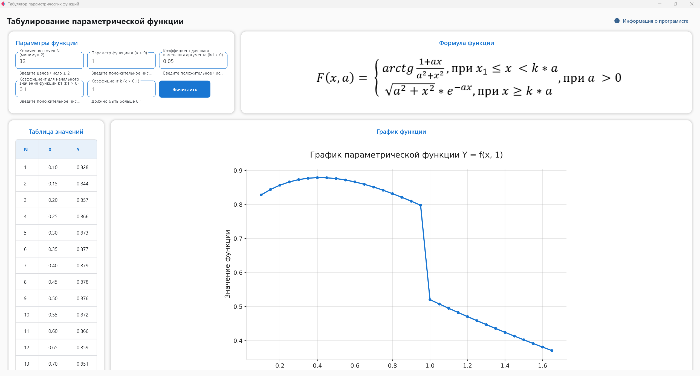

# Табулятор параметрических функций

[](https://www.python.org/downloads/)
[](https://flet.dev/)

## Описание проекта

Это приложение для вычисляет и визуализирует значения параметрической функции. Приложение позволяет задать параметры функции, вычислить значения в заданном диапазоне и отобразить результаты в виде таблицы и графика.

### Интерфейс программы


### Функция

Приложение вычисляет значения параметрической функции, определенной следующим образом:

$$
F(x,a) =
\begin{cases}
\arctan\left(\frac{1 + a x}{a^2 + x^2}\right), & x_1 \le x < k a \\
\sqrt{a^2 + x^2} \cdot e^{-a x}, & x \ge k a
\end{cases},
\quad a > 0
$$


Где:
- `a` - параметр функции
- `k` - коэффициент
- `x` - аргумент функции

## Особенности

- 🧮 **Вычисление значений**: Табулирование функции для заданного количества точек
- 📊 **Визуализация**: Построение графика функции с помощью Matplotlib
- 📋 **Таблица значений**: Отображение всех вычисленных значений в таблице
- ✅ **Валидация**: Проверка корректности вводимых параметров
- 🎨 **Современный интерфейс**: Красивый и интуитивно понятный UI на базе Flet

## Параметры функции

- **N** - Количество точек для табулирования (минимум 2)
- **a** - Параметр функции (a > 0)
- **k1** - Коэффициент для начального значения функции (k1 > 0)
- **k** - Коэффициент (k > k1)
- **kd** - Коэффициент для шага изменения аргумента (kd > 0)

## Установка и запуск

1. Клонируйте репозиторий:
   ```bash
   git clone https://github.com/SergeyR-172/Param-function-tabulator.git
   ```

2. Установите зависимости:
   ```bash
   pip install flet matplotlib numpy
   ```

3. Запустите приложение:
   ```bash
   python main_window.py
   ```

## Структура проекта

```
FunctionGraph/
├── main_window.py      # Главный файл приложения с UI
├── calculator.py       # Модуль вычислений
├── validators.py       # Валидация вводимых данных
├── dialogs.py          # Диалоговые окна
├── function_image.png  # Изображение формулы функции
└── README.md           # Документация
```

## Реализованные улучшения

В ходе разработки были реализованы следующие улучшения:

### 🎨 Интерфейс и дизайн
- Создание современного и привлекательного пользовательского интерфейса
- Использование единой цветовой палитры для всего приложения
- Добавление теней и скруглений для контейнеров
- Реализация адаптивной верстки

### ⚙️ Функциональность
- Реализация валидации всех вводимых параметров
- Создание системы диалоговых окон для отображения информации и ошибок
- Оптимизация отображения таблицы с возможностью прокрутки
- Настройка размеров графика для корректного отображения

### 📊 Визуализация
- Построение графиков с помощью Matplotlib
- Настройка размеров и DPI графиков для лучшего качества отображения
- Добавление сетки, подписей осей и заголовков
- Настройка цветовой схемы графиков

## Технологии

- **Python 3.13** - основной язык программирования
- **Flet** - фреймворк для создания веб и десктоп приложений
- **Matplotlib** - библиотека для построения графиков
- **NumPy** - библиотека для научных вычислений

## Автор

SergeyR - студент, разработчик проекта